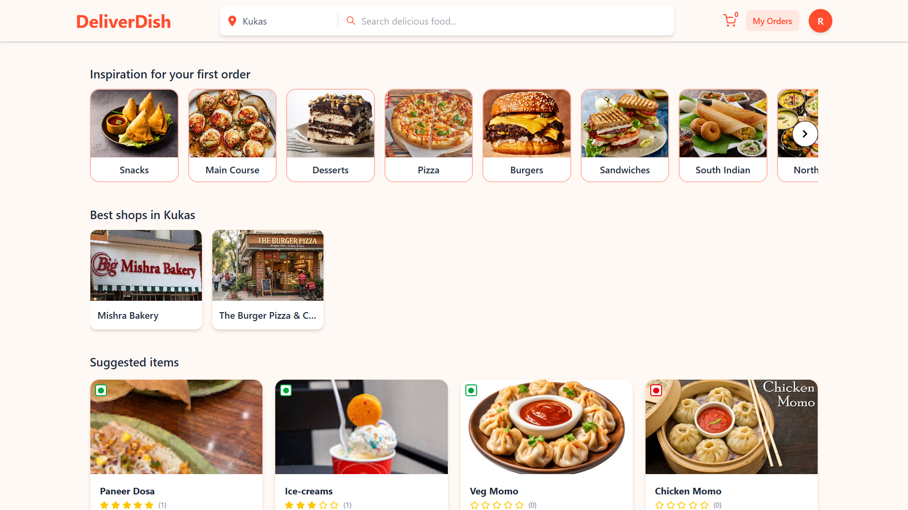
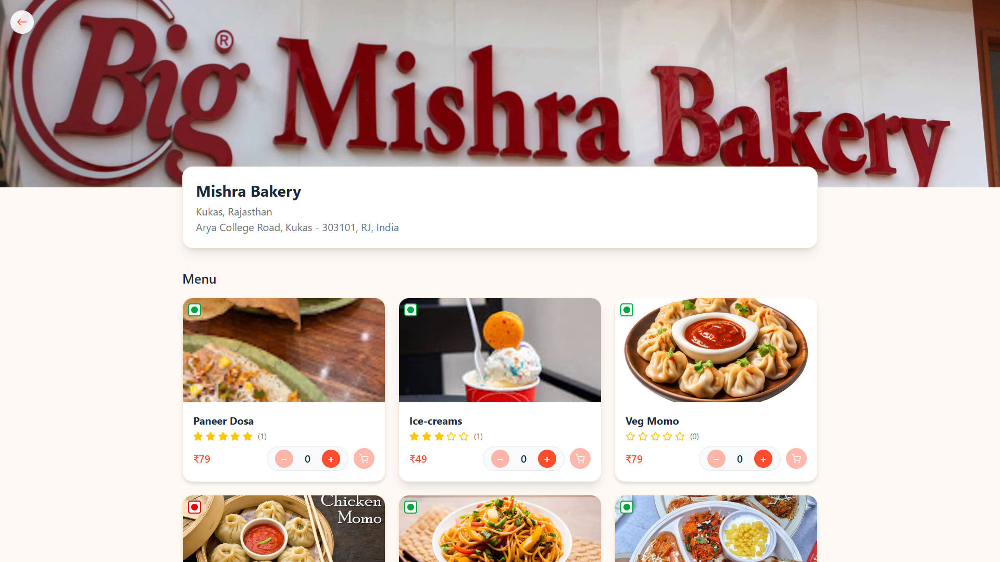
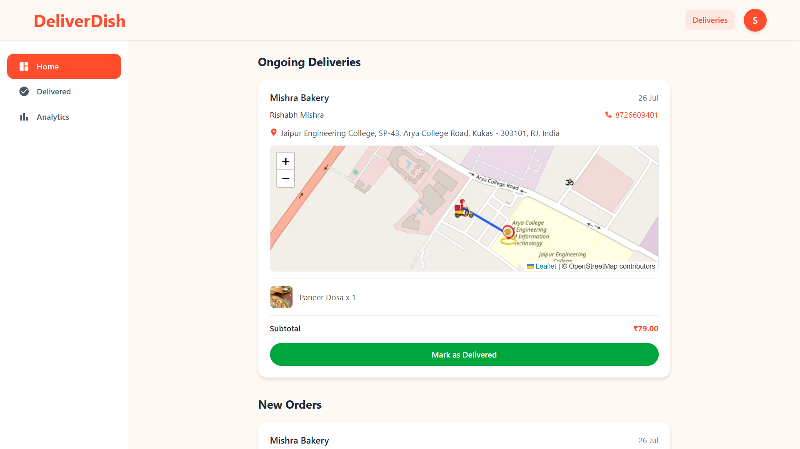

# 🍽️ DeliverDish
 
A full-stack, real-time food delivery platform built with the **MERN stack**, supporting three roles — **Customer**, **Restaurant Owner**, and **Delivery Partner** — with live order tracking, distance-based delivery matching, and integrated payments.
 
---
 
## 🚀 Features
 
### 👤 Customer

- Sign up / sign in with role selection (User, Owner, Delivery Boy)
- Auto-detected location (city, state, address) via geolocation + reverse geocoding
- Browse categories, nearby shops, and suggested items (real-time search & filters)
- Shop detail pages with full menu
- Cart with quantity controls, live totals, and toast notifications
- Checkout with editable delivery address, interactive map (Leaflet), and **Cash on Delivery** or **Razorpay online payment**
- Order history (`My Orders`) with live status polling
- **Real-time order tracking** — live map showing the delivery partner's location moving toward the customer (Socket.io)
- Rate delivered items (1–5 stars + comment); item ratings update automatically



### 🏪 Restaurant Owner

- Create/edit shop profile (name, image, address, auto-captured geolocation)
- Add, edit, delete food items (category, veg/non-veg, price, image)
- Dashboard with category, food-type, and search filters
- Manage incoming orders: `pending → preparing → out for delivery`
- View nearby available delivery partners (distance-based) once an order is dispatched
- Delivered status is handled exclusively by the assigned delivery partner



### 🛵 Delivery Partner

- Dashboard with sidebar: **Home** (new + ongoing orders), **Delivered** (history), **Analytics** (daily/monthly delivery charts)
- Broadcasted orders within a **configurable radius (default 10 km)** of the shop — first to accept gets the order (atomic, race-condition safe)
- Live location shared via GPS `watchPosition`, saved to backend and broadcast via Socket.io
- One-tap "Mark as Delivered"
- Custom map markers (scooter icon for self, home icon for customer) with a connecting route line


---
 
## 🛠️ Tech Stack
 
**Frontend**
- React (Vite)
- Redux Toolkit (state management, with localStorage persistence for cart/shops)
- React Router
- Tailwind CSS
- Axios
- React-Leaflet + Leaflet (maps)
- Socket.io-client (real-time tracking)
- Recharts (delivery analytics charts)
- React Icons
**Backend**
- Node.js + Express
- MongoDB + Mongoose
- Socket.io (real-time location broadcasting)
- JWT-based authentication (`isAuth` middleware)
- Multer (file uploads) + Cloudinary (image hosting)
- Razorpay (online payments)
- Geoapify (reverse geocoding for city/state/address)
---
 
## 📁 Project Structure
 
```
project-root/
├── backend/
│   ├── config/
│   │   └── db.js
│   ├── controllers/
│   │   ├── auth.controllers.js
│   │   ├── user.controllers.js
│   │   ├── shop.controllers.js
│   │   ├── item.controllers.js
│   │   ├── cart.controllers.js
│   │   ├── order.controllers.js
│   │   ├── location.controllers.js
│   │   └── review.controllers.js
│   ├── middlewares/
│   │   ├── isAuth.js
│   │   └── multer.js
│   ├── models/
│   │   ├── user.model.js
│   │   ├── shop.model.js
│   │   ├── item.model.js
│   │   ├── order.model.js
│   │   └── review.model.js
│   ├── routes/
│   │   ├── authroutes.js
│   │   ├── user_routes.js
│   │   ├── shop_routes.js
│   │   ├── item_routes.js
│   │   ├── cart_routes.js
│   │   ├── order_routes.js
│   │   ├── location_routes.js
│   │   └── review_routes.js
│   ├── utils/
│   │   ├── cloudinary.js
│   │   ├── razorpay.js
│   │   └── distance.js
│   ├── socket.js
│   └── index.js
│
└── frontend/
    ├── src/
    │   ├── assets/
    │   │   ├── home.png
    │   │   └── scooter.png
    │   ├── components/
    │   │   ├── Nav.jsx
    │   │   ├── CategoryCard.jsx
    │   │   ├── UserShopCard.jsx
    │   │   ├── UserItemCard.jsx
    │   │   ├── OwnerItemCard.jsx
    │   │   ├── CartItemCard.jsx
    │   │   ├── RateItemModal.jsx
    │   │   └── Toast.jsx
    │   ├── pages/
    │   │   ├── SignUp.jsx / SignIn.jsx / ForgotPassword.jsx
    │   │   ├── Home.jsx / UserDashboard.jsx / OwnerDashboard.jsx
    │   │   ├── CreateEditShop.jsx
    │   │   ├── AddItem.jsx / EditItem.jsx
    │   │   ├── ShopDetails.jsx
    │   │   ├── Cart.jsx / Checkout.jsx
    │   │   ├── MyOrders.jsx / OwnerOrders.jsx
    │   │   ├── DeliveryBoy.jsx
    │   │   └── TrackOrder.jsx
    │   ├── hooks/
    │   │   ├── useGetCurrentUser.jsx
    │   │   ├── useGetCity.jsx
    │   │   ├── useGetMyShop.jsx
    │   │   ├── useGetShopByCity.jsx
    │   │   ├── useGetCart.jsx
    │   │   ├── useUpdateLocation.jsx
    │   │   └── useToast.jsx
    │   ├── redux/
    │   │   ├── store.js
    │   │   ├── userSlice.js
    │   │   ├── ownerSlice.js
    │   │   ├── citySlice.js
    │   │   ├── cartSlice.js
    │   │   └── searchSlice.js
    │   ├── category.js
    │   ├── socket.js
    │   ├── App.jsx
    │   └── main.jsx
    └── index.html
```
 
---
 
## ⚙️ Setup & Installation
 
### Prerequisites
- Node.js (v18+)
- MongoDB (local or Atlas)
- Cloudinary account
- Razorpay account (test mode is fine)
- Geoapify API key
### 1. Clone the repository
```bash
git clone <repo-url>
cd project-root
```
 
### 2. Backend setup
```bash
cd backend
npm install
```
 
Create a `.env` file in `backend/`:
```env
PORT=8000
MONGO_URI=your_mongodb_connection_string
JWT_SECRET=your_jwt_secret
 
CLOUDINARY_CLOUD_NAME=your_cloud_name
CLOUDINARY_API_KEY=your_api_key
CLOUDINARY_API_SECRET=your_api_secret
 
RAZORPAY_KEY_ID=your_razorpay_key_id
RAZORPAY_KEY_SECRET=your_razorpay_key_secret
```
 
Run the server:
```bash
npm run dev
```
 
### 3. Frontend setup
```bash
cd frontend
npm install
```
 
Create a `.env` file in `frontend/`:
```env
VITE_GEOAPIKEY=your_geoapify_api_key
```
 
Add the Razorpay checkout script to `index.html`:
```html
<script src="https://checkout.razorpay.com/v1/checkout.js"></script>
```
 
Run the app:
```bash
npm run dev
```
 
The frontend runs on `http://localhost:5173` and the backend on `http://localhost:8000`.
 
---
 
## 🗄️ Core Data Models
 
| Model | Key Fields |
|---|---|
| **User** | `fullName`, `email`, `password`, `mobile`, `role` (`user` / `owner` / `deliveryBoy`), `city`, `location {latitude, longitude}`, `cart[]` |
| **Shop** | `name`, `image`, `owner`, `city`, `state`, `address`, `latitude`, `longitude`, `items[]` |
| **Item** | `name`, `image`, `shop`, `category`, `price`, `foodType`, `rating {average, count}` |
| **Order** | `user`, `shopOrders[]` (each with its own `shop`, `owner`, `items[]`, `status`, `deliveryBoy`), `deliveryAddress`, `paymentMethod`, `paymentStatus`, `totalAmount` |
| **Review** | `user`, `item`, `order`, `shopOrderId`, `rating`, `comment` |
 
> Orders are split **per shop** (`shopOrders`) so a single cart checkout spanning multiple restaurants creates independent, trackable sub-orders — each with its own status and delivery partner.
 
---
 
## 🔄 Order Lifecycle
 
```
pending → preparing → out for delivery → delivered
                              │
                              └── cancelled (owner, before dispatch)
```
 
1. Customer places an order (COD or Razorpay) → cart splits into `shopOrders` grouped by shop.
2. Owner updates status through `preparing` → `out for delivery`.
3. On "out for delivery", the order is broadcast to delivery partners within the configured radius of the shop.
4. First delivery partner to accept is atomically assigned (`findOneAndUpdate` guards against race conditions).
5. Delivery partner's live GPS location streams via Socket.io to the customer's `Track Order` page.
6. Delivery partner marks the order **delivered** — customer can then rate each item.
---
 
## 📡 Real-Time Architecture
 
- **Socket.io rooms** are keyed per `shopOrderId` (`track_<shopOrderId>`).
- The delivery partner emits `updateDeliveryLocation` on every GPS position change for each of their ongoing deliveries.
- The customer's tracking page joins the relevant room and listens for `deliveryLocationUpdate`, updating the map marker live — no polling required for location.
- Order lists (`My Orders`, `Owner Orders`, `Delivery Dashboard`) use lightweight polling (5s interval) for status sync, keeping the implementation simple while the location layer stays fully real-time.
---
 
## 🔑 Key API Routes
 
| Method | Route | Description |
|---|---|---|
| POST | `/api/auth/*` | Sign up, sign in, sign out, OTP/password reset |
| GET | `/api/shop/get-shop-by-city/:city` | Shops in the user's city |
| GET | `/api/shop/get-shop-by-id/:shopId` | Shop details + menu |
| POST | `/api/item/add-item` | Add a food item (owner) |
| POST | `/api/cart/update-cart` | Add/update/remove cart item |
| POST | `/api/order/place-order` | Place an order (COD or online) |
| POST | `/api/order/verify-payment` | Verify Razorpay payment signature |
| GET | `/api/order/owner-orders` | Owner's incoming orders |
| GET | `/api/order/delivery-orders` | Nearby broadcasted orders (delivery partner) |
| POST | `/api/order/accept-order/:orderId/:shopOrderId` | Accept a delivery (atomic) |
| POST | `/api/order/mark-delivered/:orderId/:shopOrderId` | Mark delivered |
| GET | `/api/order/track-order/:orderId/:shopOrderId` | Live tracking data |
| POST | `/api/review/add-review` | Rate a delivered item |
 
---
 
## 📌 Notes
 
- Delivery matching is purely **distance-based** (Haversine formula, default 10 km radius) — city is stored for display only and does not gate matching.
- Shop and delivery-partner coordinates are captured automatically via the browser's Geolocation API; delivery partners' locations refresh periodically and on movement (`watchPosition`).
- Cart and nearby-shop data are cached in `localStorage` for instant reloads and cleared on logout.
---
 
## 🧭 Roadmap Ideas
- Push notifications for order status changes
- In-app chat between customer and delivery partner
- Delivery partner earnings/payout dashboard
- Multi-language support
